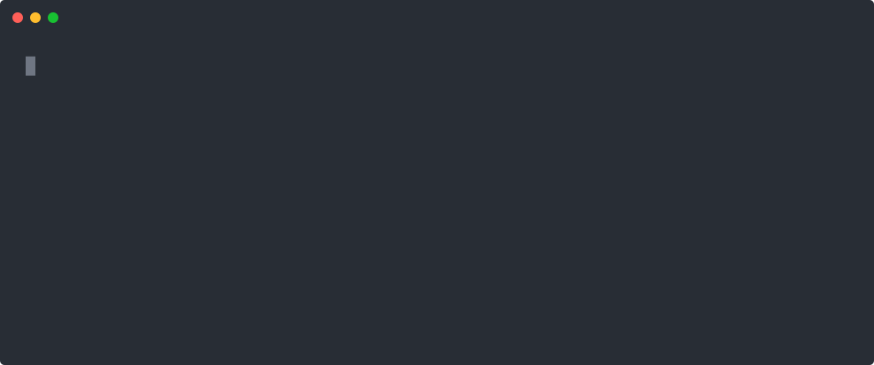

<p align="center">
  
</p>

<h1 align="center">mocon</h1>

<p align="center"><strong>OpenTelemetry for code-mode MCP servers.</strong></p>

In code mode the agent doesn't call your tools. It sends you a **program**, you run it in a sandbox,
and the program calls your tools from inside. From the outside that whole run is one opaque tool
call. Which tools it used, what it passed, what came back, how long each took, whether any of it
failed: none of it is recorded, and nothing in OpenTelemetry describes it.

mocon is the missing vocabulary, plus a small emitter for it in TypeScript and Python.

<p align="center">
  
</p>

An order failed and the trace says why, without anyone adding a log line. You can see the arguments
the agent's program chose, what each tool gave back, and the error that stopped it. The 16 kB search
result did not fit on a span, so it was cut at 96 bytes and the note carries its real size and a
hash of the whole thing: it is still identifiable, and nothing silently vanished.

That is a real run of `examples/server.mjs`, a whole code-mode server, sandbox and all. The durations
are what its tools actually took and the byte counts are what the values actually weighed. It needs
no SDK, no collector and no backend.

**Payloads are opt-in and off by default**, because they are agent-written arguments and target data.
The example turns them on with `capture: { values: true, cap: 96 }`. Decide that one deliberately.

## Install

Not on npm or PyPI yet. Until then:

```sh
git clone https://github.com/tanvincible/mocon
cd mocon && npm install && npm run build && npm pack -w mocon && cd ..
npm install ./mocon/mocon-0.1.0.tgz @opentelemetry/api
```

Python is shorter, because pip builds a path install properly:

```sh
pip install ./mocon/packages/python
```

Four steps for npm is four too many, and there's no shorter one that works. `npm install
github:tanvincible/mocon` installs the workspace root with nothing built. Installing the package
directory fails, because npm won't install a path dependency's own build tools. Packing a tarball is
what publishing does, minus the registry.

## Use

Two wrappers. That's the whole integration.

```ts
import { codeMode } from "mocon";

const observed = codeMode({
  capabilities: {
    observes_crossings: "all",   // every call the program makes comes through our bridge
    unmediated_egress: false,    // and it has no other way out
    crossing_edge: "invocation", // spans describe what the program asked for
    attested: ["crossing.target", "crossing.input", "crossing.output"],
  },
});

// One: around the handler that runs a submitted program.
return observed.execution.run({ program: source, tool: "execute" }, (execution) => {
  // Two: around the function you give the sandbox to reach you.
  const callTool = execution.instrument(bridge.callTool);
  return runInSandbox(source, { callTool });
});
```

Python is the same shape with a context manager:

```python
from mocon import CodeMode, Capabilities

observed = CodeMode(Capabilities(observes_crossings="all", unmediated_egress=False,
                                 crossing_edge="invocation", attested=["crossing.target"]))

with observed.execution(program=source, tool="execute") as execution:
    call_tool = execution.instrument(bridge.call_tool)
    return run_in_sandbox(source, call_tool)
```

Both emit the same attribute names and the same values. That's checked by a harness that runs one
scenario through both and diffs every attribute.

## Output

One `execute_code` span per dispatch, one `execute_tool` span per call the program made, correctly
parented, in whatever backend you already run. Plus two duration histograms and a log record for work
in flight, each inert until you configure a provider for it.

**No trace pipeline, and no appetite for one?** Pass `logTracer(record => logger.info(record))` and
every span becomes a flat record in the logger you already have. Same vocabulary, same join key, no
SDK and no backend. Moving to real tracing later is a different tracer, not different host code.

**Careful:** mocon emits through the OpenTelemetry API and never the SDK, so if nothing in your app
registers a tracer provider, the API is a silent no-op. No spans, no error, exit code zero. That's
OpenTelemetry's own behaviour, and it is the most common reason a first integration looks dead.

## Why it exists

OpenTelemetry already has spans, parentage and duration. Three things it has no answer for:

**Provenance.** A code-mode program is agent-written and can lie, and many hosts build their
telemetry out of what that program printed. Every value carries its class, so a reader can tell what
the host *observed* from what the program *claimed*.

**The capability declaration.** Without it, no crossing spans means either the program made no calls
or your host is blind to them. Those are opposite conclusions and a reader cannot tell them apart.

**Closed vocabularies.** Four execution dispositions and three crossing outcomes, so one consumer can
be written once and work everywhere. Span status collapses them to two.

## Documentation

**<https://tanvincible.github.io/mocon>** is the full guide: setup, what the output looks like, what
goes wrong, the API, the attribute reference, and the specification.

Build it locally with `npm run docs`, or `npm run docs:serve` to open it.

## Repository

| | |
|---|---|
| `spec/otel-code-mode.md` | the specification, ending with what it cannot do and what it has not settled |
| `packages/typescript` | `mocon`, on the OpenTelemetry API only |
| `packages/python` | `pymocon`, the same conventions, imported as `mocon` |
| `packages/python/parity` | runs one scenario through both and diffs every attribute |
| `examples/server.mjs` | a working code-mode server with mocon in it, and the run pictured above |
| `examples/record.mjs` | regenerates that picture from a real run, so it cannot drift |
| `bench/trace.mjs` | what it costs against the SDK's own floor |
| `collector/`, `dashboards/` | optional examples; it is ordinary OpenTelemetry, so use what you have |

## Status

Development. The specification is a draft. `code_mode.*` is a namespace this project owns and nobody
else has agreed to, and the `gen_ai.*` and `mcp.*` attributes it reuses are themselves Development
upstream with no compatibility guarantee.

## License

Licensed under either of the Apache License, Version 2.0 (LICENSE-APACHE) or the MIT license
(LICENSE-MIT), at your option. Unless you explicitly state otherwise, any contribution intentionally
submitted for inclusion in this work by you shall be dual licensed as above, without any additional
terms or conditions.
